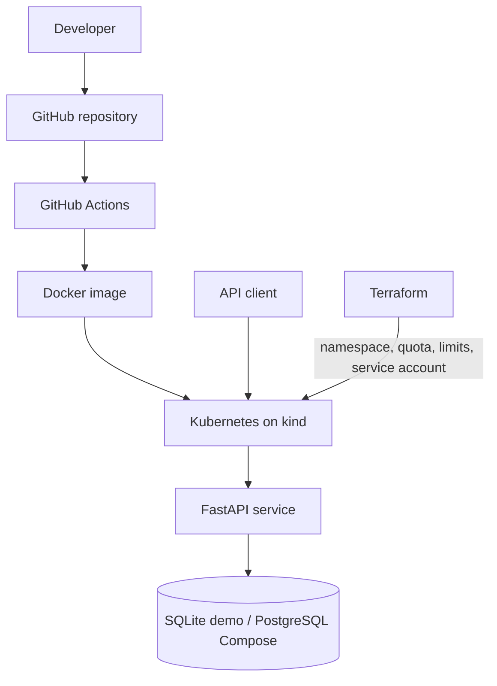

# GameOps Platform

GameOps Platform is a small cloud-native platform engineering project that demonstrates containerized application deployment, Kubernetes orchestration, Infrastructure as Code, CI, resource governance, REST API development, SQL persistence, and basic security practices.

It models an inventory and status control plane for multiplayer game servers. It does **not** launch game servers and is not production infrastructure. This independent portfolio project is inspired by hands-on learning around multiplayer server environments and has no affiliation with any game publisher.

## Why this project exists

The repository provides one understandable system in which to practice the day-to-day interfaces between application and platform engineering: health contracts, configuration, database connectivity, containers, deployment controls, infrastructure ownership, automated checks, and troubleshooting.

## Architecture



Terraform owns platform/governance resources. Files in `kubernetes/` own application resources. Keeping that boundary avoids two tools competing for the same object.

## Technology stack

- Python 3.12, FastAPI, Pydantic, SQLAlchemy 2.x
- SQLite for the simplest local run; PostgreSQL 16 with Docker Compose
- pytest and Ruff; pip-audit in CI
- Docker, Kubernetes, kind, and Terraform
- GitHub Actions for lint, tests, dependency audit, image build, and Terraform validation

## Local Python quick start

```bash
python -m venv .venv
# Linux/macOS: source .venv/bin/activate
# PowerShell: .venv\Scripts\Activate.ps1
python -m pip install -r requirements-dev.txt
cp .env.example .env  # PowerShell: Copy-Item .env.example .env
uvicorn app.main:app --reload
```

The API uses `sqlite:///./gameops.db` by default. Open Swagger UI at <http://localhost:8000/docs>.

## Docker Compose quick start

```bash
docker compose up --build
curl http://localhost:8000/readyz
docker compose down
```

Compose runs the API with PostgreSQL and waits for `pg_isready`. The default password and API key are obvious **local-development values only**. Override them without editing tracked files:

```bash
POSTGRES_PASSWORD='replace-me' GAMEOPS_API_KEY='replace-me' docker compose up --build
```

## Kubernetes + kind quick start

Prerequisites: Docker, kind, kubectl, Terraform, and GNU Make.

```bash
make kind-up
make terraform-init
make terraform-apply
export GAMEOPS_API_KEY='replace-with-a-development-key'
make k8s-deploy
make k8s-status
make k8s-port-forward
```

In another terminal, run `curl http://localhost:8000/readyz`. Clean up with:

```bash
make terraform-destroy
make kind-down
```

The Kubernetes demo intentionally uses one replica and SQLite on an `emptyDir`. Data is lost when the pod is replaced. Multiple SQLite-backed replicas would not share inventory, so they would be misleading. A persistent service should use an external PostgreSQL database.

## Terraform workflow

Terraform targets the current local kubeconfig and the `kind-gameops` context by default:

```bash
terraform -chdir=terraform init
terraform -chdir=terraform fmt -check
terraform -chdir=terraform plan
terraform -chdir=terraform apply
```

Terraform creates the `gameops` namespace, `ResourceQuota`, `LimitRange`, and application `ServiceAccount`. Kubernetes YAML creates the ConfigMap, Deployment, and Service. The API key is created separately so no usable secret is stored in Git:

```bash
kubectl create secret generic gameops-api-key \
  --namespace gameops \
  --from-literal=api-key='replace-with-a-development-key'
```

## API examples

Health and inventory reads are public in this demonstration:

```bash
curl http://localhost:8000/healthz
curl http://localhost:8000/readyz
curl http://localhost:8000/api/v1/servers
```

Create a server:

```bash
curl -X POST http://localhost:8000/api/v1/servers \
  -H "Content-Type: application/json" \
  -H "X-API-Key: development-key" \
  -d '{
    "name": "rp-server-01",
    "region": "us-east",
    "max_players": 128
  }'
```

Update status and player count, replacing `SERVER_ID` with the returned UUID:

```bash
curl -X PATCH http://localhost:8000/api/v1/servers/SERVER_ID \
  -H "Content-Type: application/json" \
  -H "X-API-Key: development-key" \
  -d '{"status":"online","players":37}'
```

Delete a server:

```bash
curl -X DELETE http://localhost:8000/api/v1/servers/SERVER_ID \
  -H "X-API-Key: development-key"
```

`scripts/demo.sh` performs a repeat-friendly health check and creates sample inventory. A duplicate name produces a readable conflict but does not stop the demo.

## API behavior and authentication

`GET /healthz` checks the process. `GET /readyz` executes `SELECT 1` so an orchestrator can stop routing traffic when the database is unavailable. Server list/get endpoints are public for demo convenience. POST, PATCH, and DELETE require `X-API-Key`; the expected value comes from `GAMEOPS_API_KEY` and is compared with `secrets.compare_digest`. Missing and invalid keys consistently return `401`.

Names are unique. Status is restricted to `offline`, `starting`, `online`, or `maintenance`. Capacity must be positive, player count cannot be negative or exceed capacity, and write errors use suitable 4xx status codes.

## Resource governance

The Terraform-managed `ResourceQuota` caps aggregate pod count, CPU, and memory requests/limits in the namespace. The `LimitRange` supplies conservative defaults when a container omits them. The Deployment also declares explicit requests and limits.

These controls improve scheduling predictability, limit a runaway workload's impact, and make resource consumption visible. They encourage cost awareness, but this small local example is not enterprise cost management.

## Security practices demonstrated

- Non-root Docker user and Kubernetes `runAsNonRoot`
- Read-only container root filesystem, default seccomp profile, no privilege escalation, and dropped Linux capabilities
- API key supplied by environment/Secret rather than embedded in the image
- Input validation plus database constraints
- Minimal service-account access with token automount disabled
- Dependency audit in CI, safe application logging, resource limits, and secret/state ignore rules

This does not make the service secure or production-ready. A single shared API key is intentionally simple and lacks identity, authorization scopes, rotation workflow, and rate limiting.

## Testing and CI

```bash
ruff check .
python -m pytest -v
pip-audit -r requirements.txt
docker build -t gameops-platform:local .
docker compose config
terraform fmt -check -recursive
terraform -chdir=terraform init -backend=false
terraform -chdir=terraform validate
```

Tests use a fresh SQLite database under pytest's temporary directory and never touch `gameops.db`. GitHub Actions runs on pushes and pull requests, with separate Python, Docker, and Terraform jobs.

## Project structure

```text
app/                    FastAPI application, models, validation, security, routers
tests/                  Isolated API and health/readiness tests
kubernetes/             Application ConfigMap, Deployment, Service, secret example
terraform/              Namespace and platform governance resources
scripts/demo.sh         Curl-based local demonstration
docs/                   Interview preparation and truthful resume notes
.github/workflows/ci.yml Automated quality and build checks
Dockerfile              Non-root Python 3.12 image
docker-compose.yml      API plus PostgreSQL development stack
kind-config.yaml        Local Kubernetes cluster configuration
Makefile                Common developer and platform workflows
```

## Production considerations

A real deployment would replace pod-local SQLite with managed PostgreSQL, use schema migrations and tested backups/restores, and retrieve short-lived secrets from a secret manager. It would add TLS and ingress/API-gateway controls, identity-based authentication and authorization, rate limiting, centralized structured logging, metrics, tracing, alerting, SLOs, and audit trails.

The platform would likely use managed multi-zone Kubernetes, multiple stateless API replicas, autoscaling, disruption budgets, network policies, scoped RBAC, admission policy, signed/scanned images, and a controlled release strategy. Terraform would use encrypted remote state with locking and reviewed environment separation. None of those capabilities is claimed by this repository.

## Learning objectives

- Design and validate a small REST API with SQL persistence
- Define application health and readiness contracts
- Build a least-privilege container and configure it through its environment
- Deploy and troubleshoot a workload on local Kubernetes
- Separate platform governance from application ownership
- Understand Terraform planning, state, and lifecycle
- Automate repeatable quality gates with CI

See [interview notes](docs/interview-notes.md) for explanations, troubleshooting commands, and project-specific interview questions. See [resume notes](docs/resume-notes.md) for claims supported by this repository.

## License

MIT. See [LICENSE](LICENSE).
